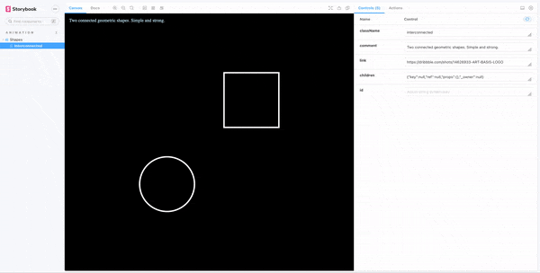
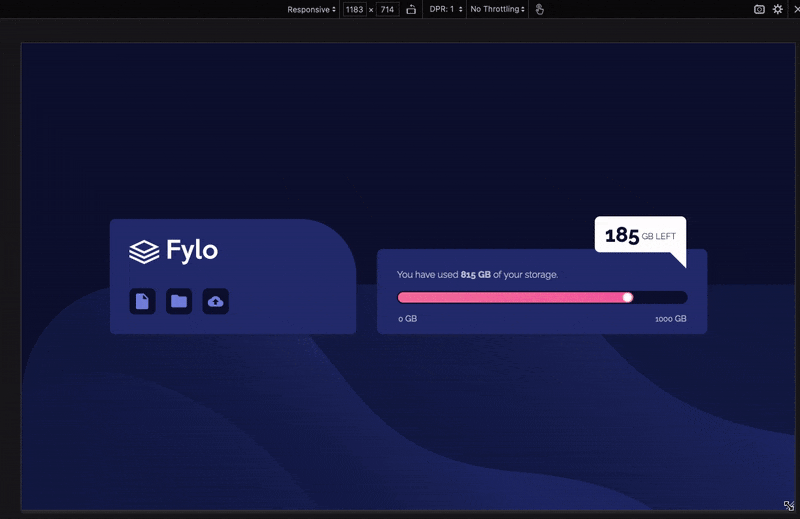

# Weekly Frontend Challenge
Every week I look through Dribbble or FrontendMentor to find something neat to replicate. I share a screencap with my friends and then get down to making it. Working from just a JPG helps improve my skills as a frontend engineer and I've learned a lot so far!

I've compiled my work as a [Storybook](https://storybook.js.org). You can see the [final results here](https://philgresh.github.io/css-challenge/).

## Completed challenges

### [Interconnected shapes](https://philgresh.github.io/css-challenge/?path=/story/animation-shapes--interconnected)
  This animation designed by Dribbble user [Alexander Borisov](https://dribbble.com/shots/14626933-ART-BASIS-LOGO) was interesting: How to overlay two shapes and have the interior filled in accordingly?

  

### [Fylo FrontendMentor](https://philgresh.github.io/css-challenge/?path=/story/frontend-fylo-storage--fylo-example)
  A front-end challenge incorporating responsive layouts, gradients, a progress bar, and icon/bar animation. From [FrontendMentor.io](https://www.frontendmentor.io/challenges/fylo-data-storage-component-1dZPRbV5n).

  
